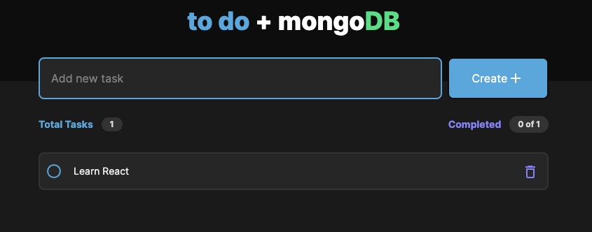

# [Next13-MongoDB-CRUD](https://nextjs-mongodb-crud-pau-velasco.vercel.app/) 

The nextjs-mongodb-crud project is a web application that utilizes NextJS 13 and MongoDB technologies to create, update, read, and delete data from a database. The application provides a user-friendly interface for users to interact by creating, editing, or deleting tasks.

For the project, the built-in API that Next allows creating has been used as the backend of the application. It also features a cron job that clears the database data once a day to provide some default tasks.

The project is deployed on Vercel, and you can access it at https://nextjs-mongodb-crud-pau-velasco.vercel.app/.

<div align="center" style="padding: 40px;">    
    
</div>


## Table of Contents

- [Features](#features)
- [Installation](#installation)
- [Usage](#usage)
- [Directory](#directory)

## Features

- Add, edit, and remove tasks.
- Mark tasks as completed or uncompleted.
- Built with NextJS and TypeScript for type-safe development.

## Installation

Before you start, make sure you have [Node.js](https://nodejs.org/) and [Yarn](https://yarnpkg.com/) installed.

1. Clone this repository to your local machine:

```bash
git clone https://github.com/PauVelasco77/nextjs-mongodb-crud
cd nextjs-mongodb-crud
``````

2. Install the project dependencies:

```bash
yarn
```

## Usage

1. To start the development server, use the following command:

```bash
yarn dev
```

This will start the development server at http://localhost:5173.

To build the production-ready version, run:

```bash
yarn build
```


## Directory

.
├── app
│   ├── api
│   │   ├── cron
│   │   │   └── route.js
│   │   ├── ping
│   │   │   └── route.js
│   │   ├── refresh
│   │   │   └── route.js
│   │   └── tasks
│   │       ├── [id]
│   │       │   └── route.js
│   │       └── route.js
│   ├── favicon.ico
│   ├── globals.css
│   ├── layout.jsx
│   ├── login
│   ├── not-found.jsx
│   ├── page.jsx
│   └── tasks
│       ├── [id]
│       │   └── page.jsx
│       └── new
│           └── page.jsx
├── assets
│   └── todo.png
├── components
│   ├── CheckButton
│   │   ├── CheckButton.jsx
│   │   └── CheckButton.module.css
│   ├── CreateTask
│   │   └── CreateTask.jsx
│   ├── DeleteButton.jsx
│   ├── LoadingTask
│   │   └── LoadingTask.jsx
│   ├── TaskCard.jsx
│   └── TasksInfo
│       └── TasksInfo.jsx
├── constants.js
├── hooks
│   ├── useApi.js
│   └── useHomePage.js
├── middleware.js
├── models
│   └── Task.js
└── utils
    ├── capitalize.js
    ├── mapApiTasks.js
    ├── mongoose.js
    └── sortTasksByComplete.js
